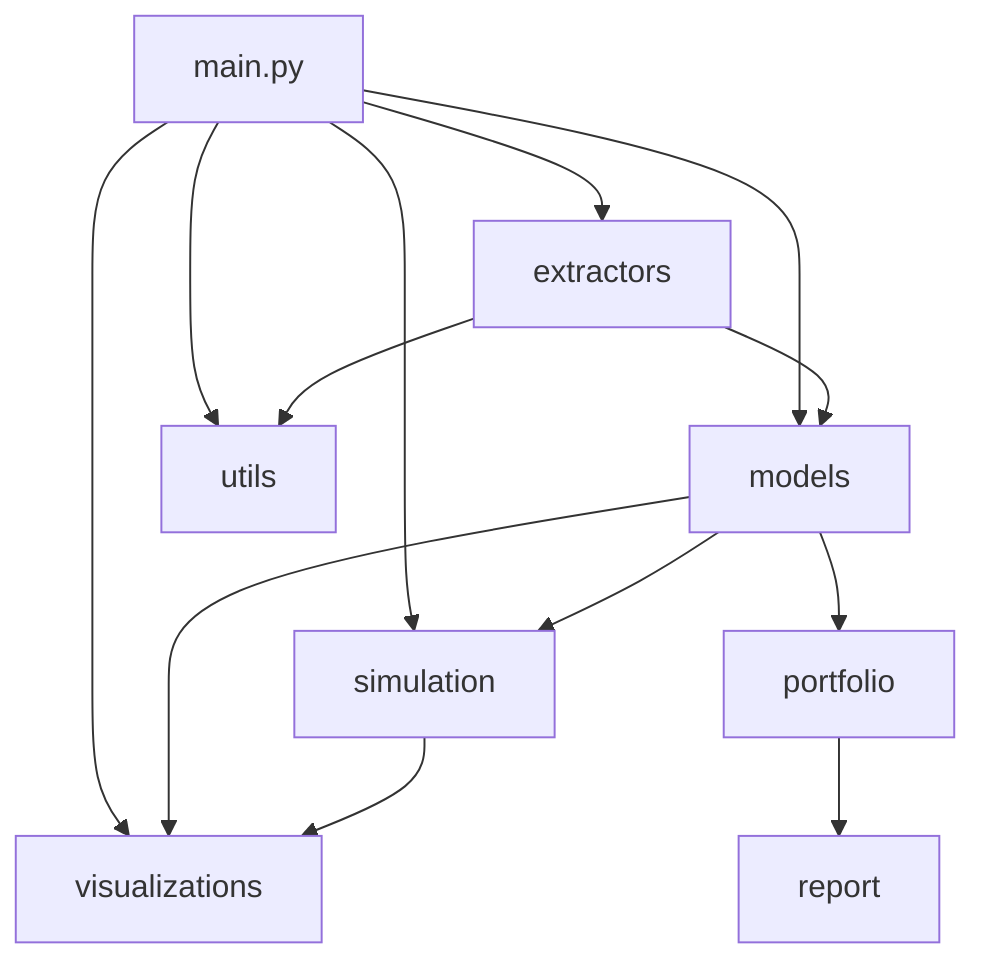

# Arquitectura Infobolsa Toolkit (Mermaid)

---

Este diagrama refleja la estructura modular y el flujo de dependencias entre los principales componentes del proyecto Infobolsa Toolkit.
- El punto de entrada es `main.py`.
- Los extractores obtienen datos y los normalizan.
- Los modelos representan series de precios y carteras.
- La simulación Monte Carlo se realiza sobre los modelos.
- Las utilidades ayudan en limpieza y preprocesado.
- Las visualizaciones muestran resultados y reportes.
- Portfolio y reportes agregan valor analítico.
